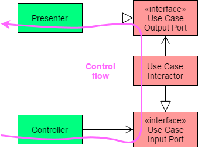

# Sumário

1. [Sobre o Projeto](#sobre-o-projeto)
2. [Configurações e Uso](#configurações-e-uso)
3. [Arquitetura e Design de Software](#arquitetura-e-design-de-software)
4. [Funcionalidades](#funcionalidades)
5. [Melhorias Futuras](#melhorias-futuras)
5. [Considerações Finais](#considerações-finais)

---

## Sobre o Projeto

## Configurações e Uso

## Arquitetura e Design de Software

<!-- 

 

 -->

## Funcionalidades

## Melhorias Futuras

## Considerações Finais