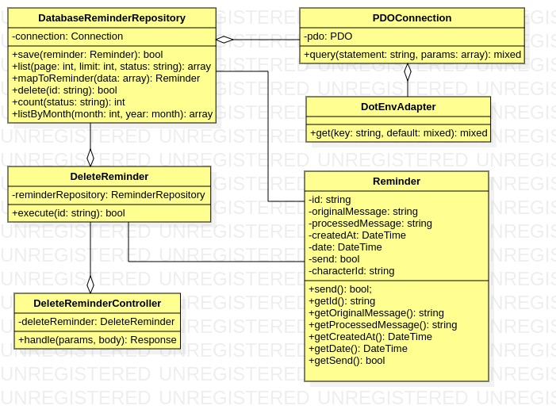
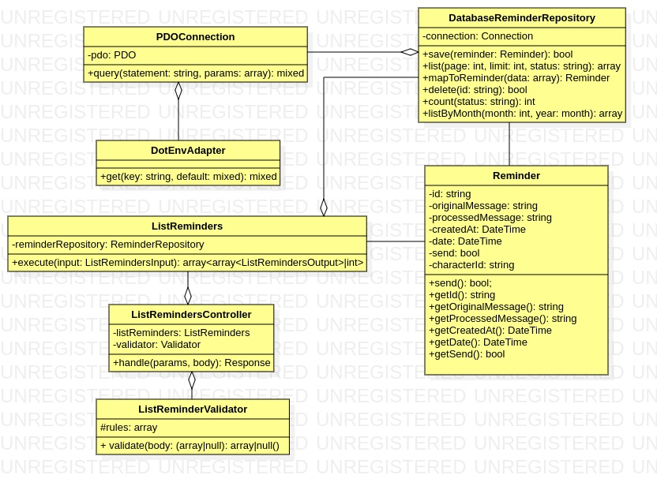

<p align="center"><a href="https://kevi.com.br" target="_blank"></a></p>

<p align="center">
<a href="README.md" target="_blank">English Version</a> - <a href="README-PT.md" target="_blank">Portuguese Version</a>
</p>


# Table of Contents

1. [About the Project](#about-the-project)
2. [Setup and Usage](#setup-and-usage)
3. [Software Architecture and Design](#software-architecture-and-design)
    - [Back-End](#back-end)
    - [Front-End](#front-end)

4. [Features](#features)
    - [Back-End](#back-end-2)
    - [Front-End](#front-end-2)

5. [Future Improvements](#future-improvements)
6. [Final Considerations](#final-considerations)

## About the Project

<p align="center"></p>

**ReminderFriendly** is an application designed to create friendly and humorous reminders. In this system, you can add a reminder using natural language and associate it with a fictional character. Your reminder will be sent to you on the correct date, with a message delivered in the humor and personality of the chosen character!

This project is part of a technical assessment for a selection process at <a href="https://kevi.com.br" target="_blank">Kevi - Retenção de Clientes</a>. The goal is to develop this application using PHP and the Slim Framework for the Back-End and Vue.js for the Front-End, utilizing the **OpenAI** API for natural language processing of the reminder and the **Z-API** to send the reminders via WhatsApp.

## Setup and Usage

<p style="display: flex; justify-content: center; background: white; border: 10px solid white; border-radius: 10px" align="center"></p>

First, clone the repository:

```bash
git clone https://github.com/Dujuniorrr/kevi-test.git
cd kevi-test
```

To properly configure the system, you need to add the API data to the `backend/.env.example` file, including the following required data:

```env
OPENAI_API_KEY=key

Z_API_TOKEN=token
Z_API_INSTANCE=instance
Z_API_CLIENT_TOKEN=client_token

PHONE=5577999999999
```

The project is divided into a SPA for the User Interface, a REST API for handling data, and a database management system (DBMS) for data persistence.

To make the application portable and create a consistent development environment for anyone who wants to run this application, Docker is used to create containers.

To start the containers, you need to <a href="https://docs.docker.com/engine/install/" target="_blank">install Docker</a>. Once installed, run the following command at the project root:

```bash
docker-compose up --build -d
```

This command will build the images according to the instructions in `Dockerfile-Backend` and `Dockerfile-Frontend` and start the service containers as configured in `docker-compose.yml`. The back-end service will run on port 9000, the front-end service on port 8000, and the MySQL DBMS on port 4000.

To create the database tables, access the MySQL DBMS container and use the database, then run the script found in `backend/database.sql` in the container's bash:

```bash
docker exec -ti db bash
mysql -u kevi -p #password: kevi
use kevi;
```

If you want to test the API using `Insomnia`, you can import the file found in `docs/Insomnia-api.json` into a new collection.

## Software Architecture and Design


### Back-End

The back-end of the application is developed in `PHP`, using the `Slim Framework` to manage API routes and depending on the `MySQL` DBMS for data persistence. Additionally, it uses `PHPUnit` for testing. The code design follows the principles of hexagonal architecture, where the system is divided into independent layers using the concept of ports and adapters.

This approach aims to keep the internal layers of the application decoupled from specific drivers (such as user interfaces, API endpoints, tests, and queues) and from external resources (such as databases, external APIs, and libraries).

In the context of hexagonal architecture, the more internal layers, which contain the core business and domain rules of the application, operate through interfaces or ports that define clear contracts. The concrete implementations of these interfaces are then adapted to different external resources, following these contracts. This allows the most critical and central classes of the application to remain independent, promoting modularity and simplified maintenance of the system as a whole, due to low coupling and enabling the creation of unit tests by using fakes and mocks that adhere to the existing interfaces.

### Front-End

The front-end of the application uses `Vue.js` as the framework for developing the system interface, with business logic written in `TypeScript` and testing done with `Jest`. Similar to the back-end, the code design follows the principles of hexagonal architecture, where the system is divided into independent layers using the concept of ports and adapters.

This approach aims to keep the internal layers of the application decoupled, particularly from Vue components and external resources (such as APIs and libraries). This design choice was made for the same reasons as in the back-end. It has made the application more flexible and testable, without coupling business rules to components and reducing complexity in the presentation layer.

## Features

<h3 id="back-end-2">Back-End</h3>

#### Endpoints

For a more detailed view of the endpoints, visit the <a href="https://app.swaggerhub.com/apis-docs/DURVALJUNIOR117/ReminderFriendlyAPI/1.0.0" target="_blank">Swagger Documentation</a>.

---

##### Create Reminder - /api/reminder (POST)


To create a reminder, access this endpoint via POST method. The route directs the parameters and request body to the `CreateReminderController`, which triggers the `CreateReminderValidator` to check if the request is valid. If valid, the controller formats the data according to the input DTO of the `CreateReminder` command. This command uses the `DatabaseCharacterRepository` to check if the requested character exists. If not, an error is returned; otherwise, the `Character` is retrieved.

Next, the natural language processing gateway `OpenAPINLPGateway` receives the content from the request body along with the character to create a fun reminder using its API via `GuzzleHTTPClient`. If the content is not understood, an exception is thrown. If understood successfully, the `Reminder` is instantiated, and the entity's data is persisted by the `DatabaseReminderRepository` in the database. Finally, an output DTO containing the data of this new reminder is returned as a response.

---

##### Send Reminder - /api/reminder/{id}/send (PUT)


To send a reminder, access this endpoint via PUT method. The route directs the parameters and request body to the `SendReminderController`, which triggers the `SendReminder` command. This command uses the `DatabaseReminderRepository` to check if the requested entity exists. If not, an error is returned; otherwise, the `Reminder` is retrieved.

The reminder then undergoes a mutation process where its send status property must be changed to `true`. If it already has this value, it has already been sent, so an exception is thrown.

If the mutation is successful, the message sending gateway `ZAPIMessageSenderGateway` sends the processed reminder with the character's humor. If everything goes well, the `DatabaseReminderRepository` updates the reminder's status to sent in the database. Finally, a success message is returned as a response.

---

##### Delete Reminder - /api/reminder/{id} (DELETE)



To delete a reminder, access this endpoint via DELETE method. The route directs the parameters and request body to the `DeleteReminderController`, which triggers the `DeleteReminder` command, sending the ID of the reminder to be deleted. This command uses the `DatabaseReminderRepository` to check if the requested entity exists. If not, an error is returned; otherwise, the `Reminder` is retrieved.

Finally, the `DatabaseReminderRepository` removes the entity from the database. A success message is returned as a response.

---

##### List Reminders - /api/reminder (GET)



To list reminders, access this endpoint via GET method. The route directs the parameters and request body to the `ListRemindersController`, which triggers the `ListReminders` command, sending an input DTO with pagination and filter data. This command uses the `DatabaseReminderRepository` to list reminders based on the input DTO. An array of `Reminder` objects is returned and converted to an output DTO, which the controller returns as JSON.

---

##### List Characters - /api/characters (GET)


To list characters, access this endpoint via GET method. The route directs the parameters and request body to the `ListCharactersController`, which triggers the `ListCharacters` command, sending an input DTO with pagination data. This command uses the `DatabaseCharacterRepository` to list characters based on the input DTO. An array of `Character` objects is returned and converted to an output DTO, which the controller returns as JSON.

#### List Reminder by Month - /api/reminder/by-month/{month}/{year} (GET)


To list reminders by month, access this endpoint via GET method. The route directs the parameters and request body to the `ListRemindersByMonthController`, which triggers the `ListRemindersByMonth` command, sending the month and year as input data. This command uses the `DatabaseReminderRepository` to list reminders based on the input DTO. An array of `Reminder` objects is returned and converted to an output DTO, which the controller returns as JSON.

### Testing


Unit and integration tests were performed with good coverage, and they were easy to implement due to the code design followed. 54 tests were conducted, with 1137 assertions and a 100% success rate.

<h3 id="front-end-2">Front-End</h3>

#### Components


Following Vue's best practices, the interface is divided into components, each with its responsibility and independence from others, aiming for low coupling. The system has a single `View`, rendered when the client requests the base route of the system. The root component, `App`, then renders the `ManageRemindersView`.

A sibling component to this view, `SplashOverlay`, is also rendered and, for a second and a half, displays on the screen showing the system's logo and a progress bar, giving the impression of project loading.

`ManageReminderView` has five child components:
- `Calendar`: Displays a calendar showing the current month's reminders.
- `ReminderList`: Lists reminders associated with the character chosen by the user, having a child component `ReminderCard`.
- `ReminderFilter`: Allows changing the number of reminders per page and filtering by sent or unsent.
- `SimpleToast`: Provides visual feedback on actions for the user.
- `AddReminderModal`: Responsible for adding new reminders, with the following child components:
  - `ReminderForm`: Allows adding the reminder text and viewing the character chosen by the user.
  - `CharacterCard`: A listing of characters to be selected.
  - `SimpleToast`: Provides visual feedback on actions for the user.

#### Classes


The class structure in the Front-End is less complex than in the Back-End, but the communication between classes still follows a well-defined interaction pattern, especially focusing on hexagonal architecture. In summary: commands communicate with gateways to perform operations, and gateways use the HTTP client to interact with the API. This structure promotes more modular, flexible, and testable code.

#### Communication Flow

1. **Commands and Gateways:**
   - **CreateReminder, DeleteReminder, SendReminder, ListReminder, ListCharacters**:
     - Each of these command classes receives an instance of the respective gateway (`ReminderGateway` or `CharacterGateway`) via dependency injection.
     - When the `execute` method is called on a command, it delegates the task to the corresponding gateway, passing the necessary parameters.
     - Example: `CreateReminder` calls `create` on `ReminderGateway` to add a new reminder.

2. **Gateways and HTTP Client:**
   - **ReminderGateway and APICharacterGateway**:
     - These gateways use `AxiosHttpClient` to make HTTP calls to the API.
     - When a method like `list`, `send`, `delete`, `create`, or `list` is called on the gateway, it builds the HTTP request and uses `AxiosHttpClient` to send it.
     - Example: `ReminderGateway` calls `post` on `AxiosHttpClient` to send a new reminder to the API.

3. **HTTP Client and API:**
   - **AxiosHttpClient**:
     - This class is responsible for performing the actual HTTP requests.
     - It provides methods such as `get`, `post`, `delete`, `put`, which are used by gateways to interact with the API.
     - Example: `AxiosHttpClient.post` sends a `POST` request to the API with the new reminder's data.

#### Appearance


The system's presentation was developed to provide a sense of comfort and fun. To achieve this result, the use of various colors and components inspired by gamified apps was essential.

### Testing


Unit and integration tests were performed for the TypeScript classes with good coverage, and they were easy to implement due to the design followed. 8 test suites were created, with 35 tests having assertions and a 100% success rate. It is worth noting that component tests were done manually, and automated tests could be implemented in the future to ensure better quality.

## Future Improvements

To further enhance the ReminderFriendly application, some of the following features and improvements could be considered:

1. **Calendar Integration:**
   - Integrate with calendar services like Google Calendar and Outlook so that reminders can be automatically synchronized with users' calendars.

2. **Multilingual Support:**
   - Add support for multiple languages to reach a broader audience.

3. **Automated Interface Testing:**
   - Implement automated tests for interface components using tools like Cypress or Selenium and Vitest to ensure user interface stability.

## Final Considerations

In addition to the documentation present in this README, it is also possible to observe the *issues* and *pull requests* closed, which serve as a way to chronologically review the decisions made to achieve the final result.

Finally, I want to thank <a href="https://kevi.com.br" target="_blank">Kevi - Retenção de Clientes</a> for the opportunity to participate in the selection process, which was very enjoyable and enriching for my professional growth.
