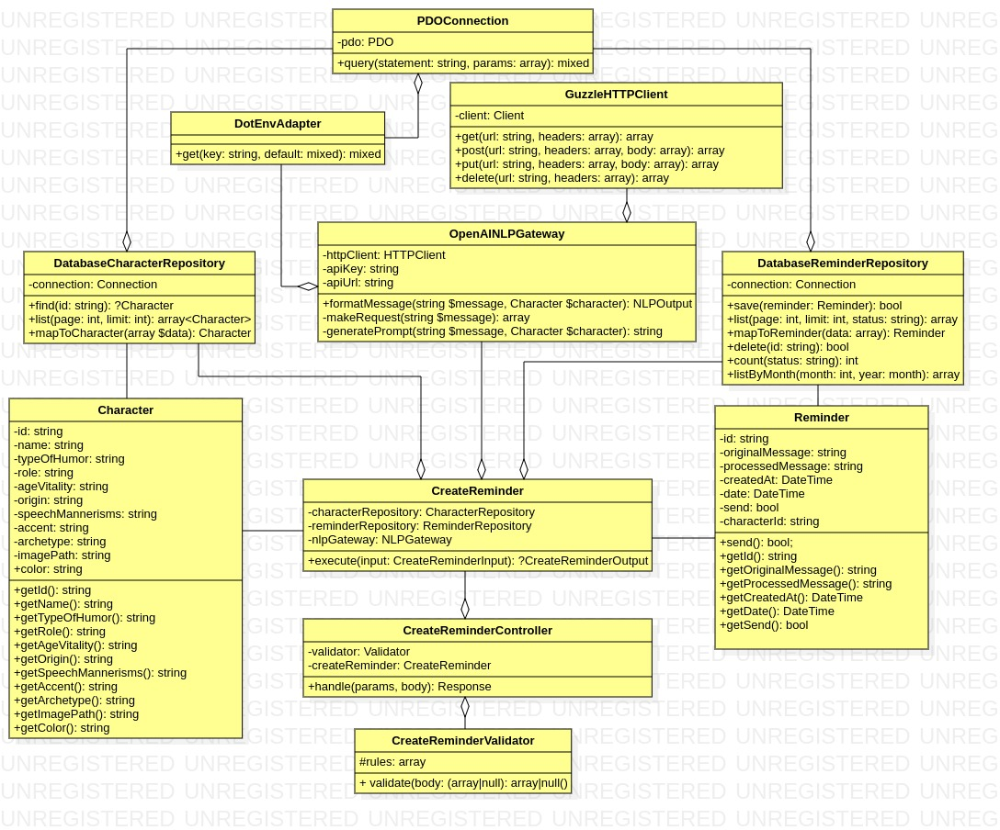
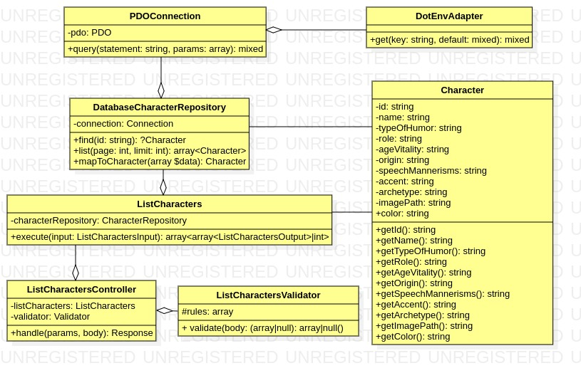
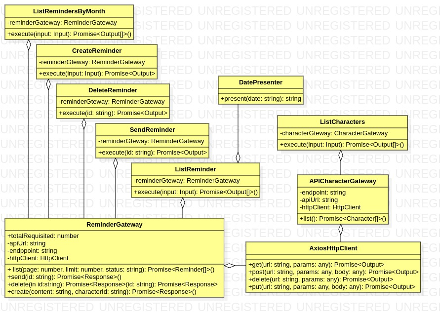

# Sumário

1. [Sobre o Projeto](#sobre-o-projeto)
2. [Configurações e Uso](#configurações-e-uso)
3. [Arquitetura e Design de Software](#arquitetura-e-design-de-software)
    - [Back-End](#back-end)
    - [Front-End](#front-end)

4. [Funcionalidades](#funcionalidades)
    - [Back-End](#back-end-2)
    - [Front-End](#front-end-2)

5. [Melhorias Futuras](#melhorias-futuras)
5. [Considerações Finais](#considerações-finais)

---

## Sobre o Projeto

## Configurações e Uso

## Arquitetura e Design de Software

### Back-End

O Back-End da aplicação utiliza o `Slim Framework` para gerenciar as rotas da API e depende do SGBD `MySQL` para persistência de dados. O design do código segue os princípios da arquitetura hexagonal, onde o sistema é dividido em camadas independentes usando o conceito de portas e adaptadores. 

Essa abordagem visa manter as camadas internas da aplicação desacopladas de drivers específicos (como interfaces de usuário, endpoints de APIs, testes e filas) e de recursos externos (como bancos de dados, APIs externas e bibliotecas). 

No contexto da arquitetura hexagonal, as camadas mais internas, que contêm as regras de negócio e de domínio centrais da aplicação, operam através de interfaces ou portas que definem contratos claros. As implementações concretas dessas interfaces são então adaptadas aos diferentes recursos externos, seguindo esses contratos. Isso permite que as classes mais críticas e próximas do núcleo da aplicação permaneçam independentes, promovendo assim a modularidade e a manutenção simplificada do sistema como um todo, já que existe baixo acoplamento e permite a criação de testes unitários criando fakes e mocks que sigam as interfaces existentes.

### Front-End 

O front-end da aplicação utiliza `Vue.js` como framework para desenvolvimento da interface do sistema, com o código voltado para o negócio desenvolvido em `TypeScript`. Assim como o Back-End, design do código segue os princípios da arquitetura hexagonal, onde o sistema é dividido em camadas independentes usando o conceito de portas e adaptadores.

Essa abordagem visa manter as camadas internas da aplicação desacopladas, principalmente dos componentes Vue e de recursos externos (como APIs e bibliotecas). Esta escolha de design foi realizada pelos mesmos motivos pelos quais foi usada no back-end. Isto tornou a aplicação mais flexível e testável, sem acoplar regras de negócios nos componentes e diminuindo a complexidade nessa camada de apresentação.

## Funcionalidades

<h3 id="back-end-2">Back-End</h3>

#### Endpoints

Para ter uma visualização mais detalhadas dos endpoints, acesse a <a href="https://app.swaggerhub.com/apis-docs/DURVALJUNIOR117/ReminderFriendlyAPI/1.0.0" target="_blank">Documentação no Swagger</a>. 

--- 

##### Create Reminder  - /api/reminder (POST)

Para criar um lembrete, deve-se acessar este endpoint via método POST. A rota direciona os parâmetros e o corpo da requisição para o `CreateReminderController`, que aciona o `CreateReminderValidator` e verifica se a requisição é válida. Caso seja, o controlador formata os dados conforme o DTO de entrada do comando `CreateReminder`. Este comando utiliza o `DatabaseCharacterRepository` para verificar se o personagem requisitado existe. Se não existir, um erro é retornado; caso contrário, o `Character` é recuperado.

Em seguida, o gateway de processamento de linguagem natural `OpenAPINLPGateway` recebe o conteúdo enviado no corpo da requisição, junto com o personagem, para criar um lembrete divertido, utilizando sua API via HTTP com o `GuzzleHTTPClient`. Se o conteúdo não for compreendido, uma exceção é disparada. Caso seja compreendido com sucesso, o `Reminder` é instanciado e os dados da entidade são persistidos pelo `DatabaseReminderRepository` na base de dados. Por fim, um DTO de saída contendo os dados deste novo lembrete é retornado como resposta.

---

##### Send Reminder  - /api/reminder/{id}/send (PUT)

Para enviar um lembrete, deve-se acessar este endpoint via método PUT. A rota direciona os parâmetros e o corpo da requisição para o `SendReminderController`, que aciona o  o comando `SendReminder`. Este comando utiliza o `DatabaseReminderRepository` para verificar se a entidade requisitada existe. Se não existir, um erro é retornado; caso contrário, o `Reminder` é recuperado. 

Este lembrete passa pelo processo de mutação onde sua propriedade de status do envio deve ser alterada para `true`, porém caso já possua este valor, ele já foi enviado, então dispara uma exceção. 

Caso a mutação seja realizada com sucesso, o gateway de envio de mensagens  `ZAPIMessageSenderGateway` realiza o envio do lembrete processado com humor do personagem, se tudo ocorrer corretamente o  `DatabaseReminderRepository` atualiza o estado do lembrete, agora com status de enviado verdadeiro, na base de dados. Por fim, uma mensagem de sucesso é retornada como resposta.

---

##### Delete Reminder  - /api/reminder/{id} (DELETE) 

Para deletar um lembrete, deve-se acessar este endpoint via método DELETE. A rota direciona os parâmetros e o corpo da requisição para o `DeleteReminderController`, que aciona o  o comando `DeleteReminder` enviando o id do lembrete a ser deletado. Este comando utiliza o `DatabaseReminderRepository` para verificar se a entidade requisitada existe. Se não existir, um erro é retornado; caso contrário, o `Reminder` é recuperado. 

Por fim o `DatabaseReminderRepository`  realiza a remoção desta entidade do banco de dados. Por fim, uma mensagem de sucesso é retornada como resposta.

---

##### List Reminders  - /api/reminder (GET) 

Para listar lembretes, deve-se acessar este endpoint via método GET. A rota direciona os parâmetros e o corpo da requisição para o `ListRemindersController`, que aciona o  o comando `ListReminders` enviando um DTO de entrada com dados de paginação e filtro. Este comando utiliza o `DatabaseReminderRepository` listar os lembretes com base no DTO de entrada. Um array de objetos `Reminder` é retornado e convertido para um DTO de saída,  o controller retorna este DTO como JSON.
 
---

##### List Characters  - /api/characters (GET) 

Para listar personagens, deve-se acessar este endpoint via método GET. A rota direciona os parâmetros e o corpo da requisição para o `ListCharactersController`, que aciona o  o comando `ListCharacters` enviando um DTO de entrada com dados de paginação. Este comando utiliza o `DatabaseCharacterRepository` listar os personagens com base no DTO de entrada. Um array de objetos `Character` é retornado e convertido para um DTO de saída,  o controller retorna este DTO como JSON.

#### List Reminder by Month  - /api/reminder/by-month/{month}/{year} (GET)

Para listar lembretes por mês, deve-se acessar este endpoint via método GET. A rota direciona os parâmetros e o corpo da requisição para o `ListRemindersByMonthController`, que aciona o  o comando `ListRemindersByMonth` enviando o mês e ano como entrada de dados. Este comando utiliza o `DatabaseReminderRepository` listar os lembretes com base no DTO de entrada. Um array de objetos `Reminder` é retornado e convertido para um DTO de saída,  o controller retorna este DTO como JSON.

### Testes

Foram realizados testes unitários e de integração com uma boa cobertura, sendo estes fáceis de implementar devido ao design de código seguido. 54 testes foram feitos, com 1137 asserções e 100% de acerto.

<h3 id="front-end-2">Front-End</h3>

#### Componentes

Seguindo as melhores práticas do Vue, a interface foi dividida em componentes, onde cada um tem sua responsabilidade e é independente dos outros, prezando pelo baixo acoplamento. O sistema possui apenas uma `View`, que é renderizada quando o cliente requisita a rota base do sistema, o componente `App`, raiz do projeto, renderiza então esta `ManageRemindersView`.

O componente irmão desta view, `SplashOverlay`, também é renderizado e, durante um segundo e meio, ele aparece na tela mostrando a logo do sistema e uma barra de progresso, dando a impressão de carregamento do projeto.

`ManageReminderView` possui cinco componentes filhos, sendo eles:
- `Calendar`: Possui um calendário mostrando os lembretes do mês atual.
- `ReminderList`: Lista os lembretes atrelados ao personagem escolhido pelo usuário, tendo como componente filho `ReminderCard`.
- `ReminderFilter`: Permite alterar o número de lembretes por página e filtrar por enviados ou não enviados.
- `SimpleToast`: Responsável por dar feedbacks visuais das ações para o usuário.
- `AddReminderModal`: Responsável por permitir a adição de novos lembretes, tendo os seguintes componentes filhos:
  - `ReminderForm`: Onde é possível adicionar o texto do lembrete e visualizar o personagem escolhido pelo usuário.
  - `CharacterCard`: Uma listagem com personagens a serem selecionados.
  - `SimpleToast`: Responsável por dar feedbacks visuais das ações para o usuário.

#### Classes

 
A disposição de classes presentes no Front-End é menos complexa que a do Back-End, mas a comunicação entre as classes ainda segue um padrão de interações bem definido, especialmente focado na arquitetura hexagonal. De forma resumida: commands se comunicam com os gateways para realizar operações, e os gateways utilizam o cliente HTTP para interagir com a API. Essa estrutura promove um código mais modular, flexível e fácil de testar.

#### Fluxo de Comunicação

1. **Commands e Gateways:**
   - **CreateReminder, DeleteReminder, SendReminder, ListReminder, ListCharacters**:
     - Cada uma dessas classes de command recebe uma instância do respectivo gateway (`ReminderGateway` ou `CharacterGateway`) via injeção de dependência.
     - Quando o método `execute` é chamado em um command, ele delega a tarefa ao gateway correspondente, passando os parâmetros necessários.
     - Exemplo: `CreateReminder` chama `create` no `ReminderGateway` para adicionar um novo lembrete.

2. **Gateways e Cliente HTTP:**
   - **ReminderGateway e APICharacterGateway**:
     - Esses gateways utilizam `AxiosHttpClient` para fazer as chamadas HTTP para a API.
     - Quando um método como `list`, `send`, `delete`, `create`, ou `list` é chamado no gateway, ele constrói a requisição HTTP e utiliza o `AxiosHttpClient` para enviá-la.
     - Exemplo: `ReminderGateway` chama `post` no `AxiosHttpClient` para enviar um novo lembrete para a API.

3. **Cliente HTTP e API:**
   - **AxiosHttpClient**:
     - Esta classe é responsável por realizar as requisições HTTP reais.
     - Ela fornece métodos como `get`, `post`, `delete`, `put`, que são utilizados pelos gateways para interagir com a API.
     - Exemplo: `AxiosHttpClient.post` envia uma requisição `POST` para a API com os dados do novo lembrete.

### Testes

Foram realizados testes unitários e de integração para as classes em `TypeScript` com uma boa cobertura, sendo estes fáceis de implementar devido ao design de código seguido. 8 suites de testes foram feitos, com 35 testes tendo asserções e 100% de acerto. Vale ressaltar que os testes dos componentes foram feitos manualmente, podendo ser realizados testes automatizados no futuro para assegurar melhor qualidade.

## Melhorias Futuras

## Considerações Finais